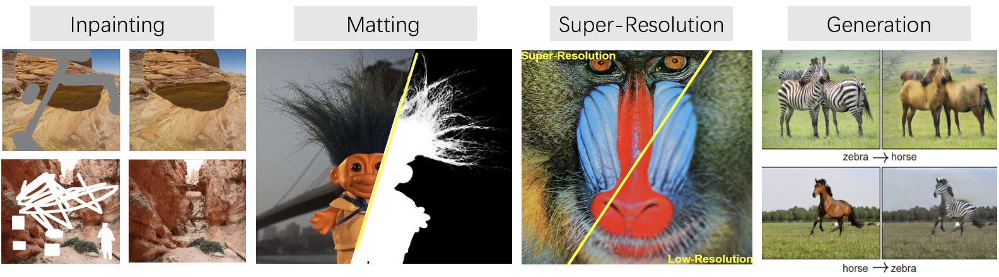

  

 

## Introduction

MMEditing is an open source image and video editing toolbox based on PyTorch. It is a part of the [OpenMMLab](https://open-mmlab.github.io/) project.

The master branch works with **PyTorch 1.3 to 1.6**.

Documentation: https://mmediting.readthedocs.io/en/latest/.

  

### Major features

- **Modular design**

  We decompose the editing framework into different components and one can easily construct a customized editor framework by combining different modules.

- **Support of multiple tasks in editing**

  The toolbox directly supports popular and contemporary *inpainting*, *matting*, *super-resolution* and *generation* tasks.

- **State of the art**

  The toolbox provides state-of-the-art methods in inpainting/matting/super-resolution/generation.

## License

This project is released under the [Apache 2.0 license](LICENSE).

## Changelog

v0.5 was released in 09/07/2020.

Note that **MMSR** has been merged into this repo, as a part of MMEditing.
With elaborate designs of the new framework and careful implementations,
hope MMEditing could provide better experience.

## Benchmark and model zoo

Please refer to [model_zoo.md](docs/model_zoo.md) for more details.

## Installation

Please refer to [install.md](docs/install.md) for installation.

## Get Started

Please see [getting_started.md](docs/getting_started.md) for the basic usage of MMEditing.

## Contributing

We appreciate all contributions to improve MMEditing. Please refer to [CONTRIBUTING.md in MMDetection](https://github.com/open-mmlab/mmdetection/blob/master/.github/CONTRIBUTING.md) for the contributing guideline.

## Acknowledgement

MMEditing is an open source project that is contributed by researchers and engineers from various colleges and companies. We appreciate all the contributors who implement their methods or add new features, as well as users who give valuable feedbacks. We wish that the toolbox and benchmark could serve the growing research community by providing a flexible toolkit to reimplement existing methods and develop their own new methods.
