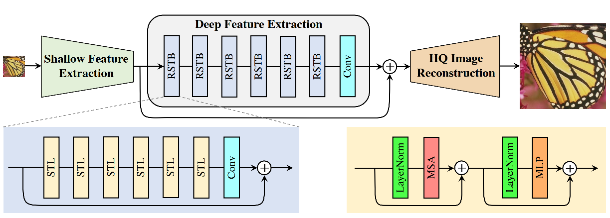

# SwinIR (ICCVW'2021)

> [SwinIR: Image Restoration Using Swin Transformer](https://arxiv.org/abs/2108.10257)

> **Task**: Image Super-Resolution

<!-- [ALGORITHM] -->

## Abstract

<!-- [ABSTRACT] -->

mage restoration is a long-standing low-level vision problem that aims to restore high-quality images from low-quality images (e.g., downscaled, noisy and compressed images). While state-of-the-art image restoration methods are based on convolutional neural networks, few attempts have been made with Transformers which show impressive performance on high-level vision tasks. In this paper, we propose a strong baseline model SwinIR for image restoration based on the Swin Transformer. SwinIR consists of three parts: shallow feature extraction, deep feature extraction and high-quality image reconstruction. In particular, the deep feature extraction module is composed of several residual Swin Transformer blocks (RSTB), each of which has several Swin Transformer layers together with a residual connection. We conduct experiments on three representative tasks: image super-resolution (including classical, lightweight and real-world image super-resolution), image denoising (including grayscale and color image denoising) and JPEG compression artifact reduction. Experimental results demonstrate that SwinIR outperforms state-of-the-art methods on different tasks by up to 0.14~0.45dB, while the total number of parameters can be reduced by up to 67%.

<!-- [IMAGE] -->

<div align=center >
 
</div >

## Results and models

Evaluated on RGB channels, `scale` pixels in each border are cropped before evaluation.
The metrics are `PSNR / SSIM` .

|                                    Method                                    | Set5 PSNR | Set14 PSNR | Set5 SSIM | Set14 SSIM | GPU Info |                                    Download                                    |
| :--------------------------------------------------------------------------: | :-------: | :--------: | :-------: | :--------: | :------: | :----------------------------------------------------------------------------: |
| [swinir_x2_p64w8_d6e180_500k_df2k](/configs/swinir/swinir_x2_p64w8_d6e180_500k_df2k.py) |  36.2104  |  32.3254   |  0.9458   |   0.8997   |    1     | [model](https://drive.google.com/file/d/1Uw1QtPKnBvFalgx8sC-moFmTLCBtfbqM/view?usp=share_link) \\ |
| [swinir_x3_p64w8_d6e180_500k_df2k](/configs/swinir/swinir_x3_p64w8_d6e180_500k_df2k.py) |  32.9243  |  29.0268   |  0.9080   |   0.8212   |    1     | [model](https://drive.google.com/file/d/13VOC_15bH4OcfqLX3TYa3NwoTSADKH9b/view?usp=share_link) \\ |
| [swinir_x4_p64w8_d6e180_500k_df2k](/configs/swinir/swinir_x4_p64w8_d6e180_500k_df2k.py) |  30.9975  |  27.2786   |  0.8757   |   0.8973   |    1     | [model](https://drive.google.com/file/d/12IXYTR_3UebYbTqR9wumBEv5AlL6Qyr9/view?usp=share_link) \\ |
| [swinir_x2_p48w8_d6e180_500k_div2k](/configs/swinir/swinir_x2_p48w8_d6e180_500k_div2k.py) |  36.1395  |  32.0471   |  0.9453   |   0.9398   |    1     | [model](https://drive.google.com/file/d/1NwpDavsYKNcVptQyUrCzFp2ArAtBV6a2/view?usp=share_link) \\ |
| [swinir_x3_p48w8_d6e180_500k_div2k](/configs/swinir/swinir_x3_p48w8_d6e180_500k_div2k.py) |  32.8619  |  28.8743   |  0.9073   |   0.8178   |    1     | [model](https://drive.google.com/file/d/11fn_CkgaYl-flzaeJeapKa0d17RwPNQ9/view?usp=share_link) \\ |
| [swinir_x4_p48w8_d6e180_500k_div2k](/configs/swinir/swinir_x4_p48w8_d6e180_500k_div2k.py) |  30.8093  |  27.1080   |  0.8729   |   0.7540   |    1     | [model](https://drive.google.com/file/d/1KWaJ3X6ZrXJZ37jHczdjRTcElQ_sPTpP/view?usp=share_link) \\ |
| [swinir_x2_p64w8_d4e60_500k_div2k](/configs/swinir/swinir_x2_p64w8_d4e60_500k_div2k.py) |  35.9517  |  31.7807   |  0.9442   |   0.8948   |    1     | [model](https://drive.google.com/file/d/13dDwSMxjBpZZiXlgKHH9onkxzLUKZ0LX/view?usp=share_link) \\ |
| [swinir_x3_p64w8_d4e60_500k_div2k](/configs/swinir/swinir_x3_p64w8_d4e60_500k_div2k.py) |  32.6025  |  28.6482   |  0.9045   |   0.8136   |    1     | [model](https://drive.google.com/file/d/1Jj0Mdyd2sbaaredwNxVtp0zraHr_EgCN/view?usp=share_link) \\ |
| [swinir_x4_p64w8_d4e60_500k_div2k](/configs/swinir/swinir_x4_p64w8_d4e60_500k_div2k.py) |  30.5225  |  26.9440   |  0.8678   |   0.7484   |    1     | [model](https://drive.google.com/file/d/1hf-Bod4nAo13dRgyHKYiAi260a1sYCT8/view?usp=share_link) \\ |

## Quick Start

**Train**

<details>
<summary>Train Instructions</summary>

You can use the following commands to train a model with cpu or single/multiple GPUs.

```shell
# cpu train
# 001 Classical Image Super-Resolution (middle size)
# (setting1: when model is trained on DIV2K and with training_patch_size=48)
CUDA_VISIBLE_DEVICES=-1 python tools/train.py configs/swinir/swinir_x2_p48w8_d6e180_500k_div2k.py
CUDA_VISIBLE_DEVICES=-1 python tools/train.py configs/swinir/swinir_x3_p48w8_d6e180_500k_div2k.py
CUDA_VISIBLE_DEVICES=-1 python tools/train.py configs/swinir/swinir_x4_p48w8_d6e180_500k_div2k.py

# (setting2: when model is trained on DIV2K+Flickr2K and with training_patch_size=64)
CUDA_VISIBLE_DEVICES=-1 python tools/train.py configs/swinir/swinir_x2_p64w8_d6e180_500k_df2k.py
CUDA_VISIBLE_DEVICES=-1 python tools/train.py configs/swinir/swinir_x3_p64w8_d6e180_500k_df2k.py
CUDA_VISIBLE_DEVICES=-1 python tools/train.py configs/swinir/swinir_x4_p64w8_d6e180_500k_df2k.py

# 002 Lightweight Image Super-Resolution (small size)
CUDA_VISIBLE_DEVICES=-1 python tools/train.py configs/swinir/swinir_x2_p64w8_d4e60_500k_div2k.py
CUDA_VISIBLE_DEVICES=-1 python tools/train.py configs/swinir/swinir_x3_p64w8_d4e60_500k_div2k.py
CUDA_VISIBLE_DEVICES=-1 python tools/train.py configs/swinir/swinir_x4_p64w8_d4e60_500k_div2k.py


# single-gpu train
# 001 Classical Image Super-Resolution (middle size)
# (setting1: when model is trained on DIV2K and with training_patch_size=48)
python tools/train.py configs/swinir/swinir_x2_p48w8_d6e180_500k_div2k.py
python tools/train.py configs/swinir/swinir_x3_p48w8_d6e180_500k_div2k.py
python tools/train.py configs/swinir/swinir_x4_p48w8_d6e180_500k_div2k.py

# (setting2: when model is trained on DIV2K+Flickr2K and with training_patch_size=64)
python tools/train.py configs/swinir/swinir_x2_p64w8_d6e180_500k_df2k.py
python tools/train.py configs/swinir/swinir_x3_p64w8_d6e180_500k_df2k.py
python tools/train.py configs/swinir/swinir_x4_p64w8_d6e180_500k_df2k.py

# 002 Lightweight Image Super-Resolution (small size)
python tools/train.py configs/swinir/swinir_x2_p64w8_d4e60_500k_div2k.py
python tools/train.py configs/swinir/swinir_x3_p64w8_d4e60_500k_div2k.py
python tools/train.py configs/swinir/swinir_x4_p64w8_d4e60_500k_div2k.py


# multi-gpu train
# 001 Classical Image Super-Resolution (middle size)
# (setting1: when model is trained on DIV2K and with training_patch_size=48)
./tools/dist_train.sh configs/swinir/swinir_x2_p48w8_d6e180_500k_div2k.py 8
./tools/dist_train.sh configs/swinir/swinir_x3_p48w8_d6e180_500k_div2k.py 8
./tools/dist_train.sh configs/swinir/swinir_x4_p48w8_d6e180_500k_div2k.py 8

# (setting2: when model is trained on DIV2K+Flickr2K and with training_patch_size=64)
./tools/dist_train.sh configs/swinir/swinir_x2_p64w8_d6e180_500k_df2k.py 8
./tools/dist_train.sh configs/swinir/swinir_x3_p64w8_d6e180_500k_df2k.py 8
./tools/dist_train.sh configs/swinir/swinir_x4_p64w8_d6e180_500k_df2k.py 8

# 002 Lightweight Image Super-Resolution (small size)
./tools/dist_train.sh configs/swinir/swinir_x2_p64w8_d4e60_500k_div2k.py 8
./tools/dist_train.sh configs/swinir/swinir_x3_p64w8_d4e60_500k_div2k.py 8
./tools/dist_train.sh configs/swinir/swinir_x4_p64w8_d4e60_500k_div2k.py 8
```

For more details, you can refer to **Train a model** part in [train_test.md](/docs/en/user_guides/train_test.md#Train-a-model-in-MMEditing).

</details>

**Test**

<details>
<summary>Test Instructions</summary>

You can use the following commands to test a model with cpu or single/multiple GPUs.

```shell
# cpu test
# 001 Classical Image Super-Resolution (middle size)
# (setting1: when model is trained on DIV2K and with training_patch_size=48)
CUDA_VISIBLE_DEVICES=-1 python tools/test.py configs/swinir/swinir_x2_p48w8_d6e180_500k_div2k.py https://drive.google.com/file/d/1NwpDavsYKNcVptQyUrCzFp2ArAtBV6a2/view?usp=share_link
CUDA_VISIBLE_DEVICES=-1 python tools/test.py configs/swinir/swinir_x3_p48w8_d6e180_500k_div2k.py https://drive.google.com/file/d/11fn_CkgaYl-flzaeJeapKa0d17RwPNQ9/view?usp=share_link
CUDA_VISIBLE_DEVICES=-1 python tools/test.py configs/swinir/swinir_x4_p48w8_d6e180_500k_div2k.py https://drive.google.com/file/d/1KWaJ3X6ZrXJZ37jHczdjRTcElQ_sPTpP/view?usp=share_link

# (setting2: when model is trained on DIV2K+Flickr2K and with training_patch_size=64)
CUDA_VISIBLE_DEVICES=-1 python tools/test.py configs/swinir/swinir_x2_p64w8_d6e180_500k_df2k.py https://drive.google.com/file/d/1Uw1QtPKnBvFalgx8sC-moFmTLCBtfbqM/view?usp=share_link
CUDA_VISIBLE_DEVICES=-1 python tools/test.py configs/swinir/swinir_x3_p64w8_d6e180_500k_df2k.py https://drive.google.com/file/d/13VOC_15bH4OcfqLX3TYa3NwoTSADKH9b/view?usp=share_link
CUDA_VISIBLE_DEVICES=-1 python tools/test.py configs/swinir/swinir_x4_p64w8_d6e180_500k_df2k.py https://drive.google.com/file/d/12IXYTR_3UebYbTqR9wumBEv5AlL6Qyr9/view?usp=share_link

# 002 Lightweight Image Super-Resolution (small size)
CUDA_VISIBLE_DEVICES=-1 python tools/test.py configs/swinir/swinir_x2_p64w8_d4e60_500k_div2k.py https://drive.google.com/file/d/13dDwSMxjBpZZiXlgKHH9onkxzLUKZ0LX/view?usp=share_link
CUDA_VISIBLE_DEVICES=-1 python tools/test.py configs/swinir/swinir_x3_p64w8_d4e60_500k_div2k.py https://drive.google.com/file/d/1Jj0Mdyd2sbaaredwNxVtp0zraHr_EgCN/view?usp=share_link
CUDA_VISIBLE_DEVICES=-1 python tools/test.py configs/swinir/swinir_x4_p64w8_d4e60_500k_div2k.py https://drive.google.com/file/d/1hf-Bod4nAo13dRgyHKYiAi260a1sYCT8/view?usp=share_link


# single-gpu test
# 001 Classical Image Super-Resolution (middle size)
# (setting1: when model is trained on DIV2K and with training_patch_size=48)
python tools/test.py configs/swinir/swinir_x2_p48w8_d6e180_500k_div2k.py https://drive.google.com/file/d/1NwpDavsYKNcVptQyUrCzFp2ArAtBV6a2/view?usp=share_link
python tools/test.py configs/swinir/swinir_x3_p48w8_d6e180_500k_div2k.py https://drive.google.com/file/d/11fn_CkgaYl-flzaeJeapKa0d17RwPNQ9/view?usp=share_link
python tools/test.py configs/swinir/swinir_x4_p48w8_d6e180_500k_div2k.py https://drive.google.com/file/d/1KWaJ3X6ZrXJZ37jHczdjRTcElQ_sPTpP/view?usp=share_link

# (setting2: when model is trained on DIV2K+Flickr2K and with training_patch_size=64)
python tools/test.py configs/swinir/swinir_x2_p64w8_d6e180_500k_df2k.py https://drive.google.com/file/d/1Uw1QtPKnBvFalgx8sC-moFmTLCBtfbqM/view?usp=share_link
python tools/test.py configs/swinir/swinir_x3_p64w8_d6e180_500k_df2k.py https://drive.google.com/file/d/13VOC_15bH4OcfqLX3TYa3NwoTSADKH9b/view?usp=share_link
python tools/test.py configs/swinir/swinir_x4_p64w8_d6e180_500k_df2k.py https://drive.google.com/file/d/12IXYTR_3UebYbTqR9wumBEv5AlL6Qyr9/view?usp=share_link

# 002 Lightweight Image Super-Resolution (small size)
python tools/test.py configs/swinir/swinir_x2_p64w8_d4e60_500k_div2k.py https://drive.google.com/file/d/13dDwSMxjBpZZiXlgKHH9onkxzLUKZ0LX/view?usp=share_link
python tools/test.py configs/swinir/swinir_x3_p64w8_d4e60_500k_div2k.py https://drive.google.com/file/d/1Jj0Mdyd2sbaaredwNxVtp0zraHr_EgCN/view?usp=share_link
python tools/test.py configs/swinir/swinir_x4_p64w8_d4e60_500k_div2k.py https://drive.google.com/file/d/1hf-Bod4nAo13dRgyHKYiAi260a1sYCT8/view?usp=share_link


# multi-gpu test
# 001 Classical Image Super-Resolution (middle size)
# (setting1: when model is trained on DIV2K and with training_patch_size=48)
./tools/dist_test.sh configs/swinir/swinir_x2_p48w8_d6e180_500k_div2k.py https://drive.google.com/file/d/1NwpDavsYKNcVptQyUrCzFp2ArAtBV6a2/view?usp=share_link
./tools/dist_test.sh configs/swinir/swinir_x3_p48w8_d6e180_500k_div2k.py https://drive.google.com/file/d/11fn_CkgaYl-flzaeJeapKa0d17RwPNQ9/view?usp=share_link
./tools/dist_test.sh configs/swinir/swinir_x4_p48w8_d6e180_500k_div2k.py https://drive.google.com/file/d/1KWaJ3X6ZrXJZ37jHczdjRTcElQ_sPTpP/view?usp=share_link

# (setting2: when model is trained on DIV2K+Flickr2K and with training_patch_size=64)
./tools/dist_test.sh configs/swinir/swinir_x2_p64w8_d6e180_500k_df2k.py https://drive.google.com/file/d/1Uw1QtPKnBvFalgx8sC-moFmTLCBtfbqM/view?usp=share_link
./tools/dist_test.sh configs/swinir/swinir_x3_p64w8_d6e180_500k_df2k.py https://drive.google.com/file/d/13VOC_15bH4OcfqLX3TYa3NwoTSADKH9b/view?usp=share_link
./tools/dist_test.sh configs/swinir/swinir_x4_p64w8_d6e180_500k_df2k.py https://drive.google.com/file/d/12IXYTR_3UebYbTqR9wumBEv5AlL6Qyr9/view?usp=share_link

# 002 Lightweight Image Super-Resolution (small size)
./tools/dist_test.sh configs/swinir/swinir_x2_p64w8_d4e60_500k_div2k.py https://drive.google.com/file/d/13dDwSMxjBpZZiXlgKHH9onkxzLUKZ0LX/view?usp=share_link
./tools/dist_test.sh configs/swinir/swinir_x3_p64w8_d4e60_500k_div2k.py https://drive.google.com/file/d/1Jj0Mdyd2sbaaredwNxVtp0zraHr_EgCN/view?usp=share_link
./tools/dist_test.sh configs/swinir/swinir_x4_p64w8_d4e60_500k_div2k.py https://drive.google.com/file/d/1hf-Bod4nAo13dRgyHKYiAi260a1sYCT8/view?usp=share_link
```

For more details, you can refer to **Test a pre-trained model** part in [train_test.md](/docs/en/user_guides/train_test.md#Test-a-pre-trained-model-in-MMEditing).

</details>

## Citation

```bibtex
@inproceedings{liang2021swinir,
  title={Swinir: Image restoration using swin transformer},
  author={Liang, Jingyun and Cao, Jiezhang and Sun, Guolei and Zhang, Kai and Van Gool, Luc and Timofte, Radu},
  booktitle={Proceedings of the IEEE/CVF International Conference on Computer Vision},
  pages={1833--1844},
  year={2021}
}
```
